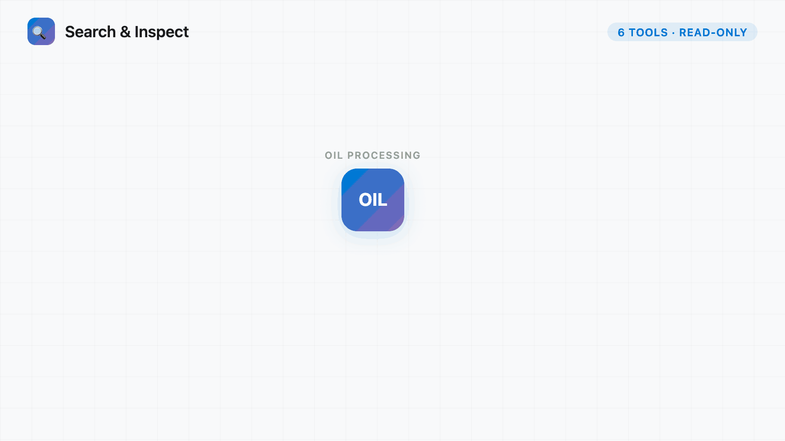
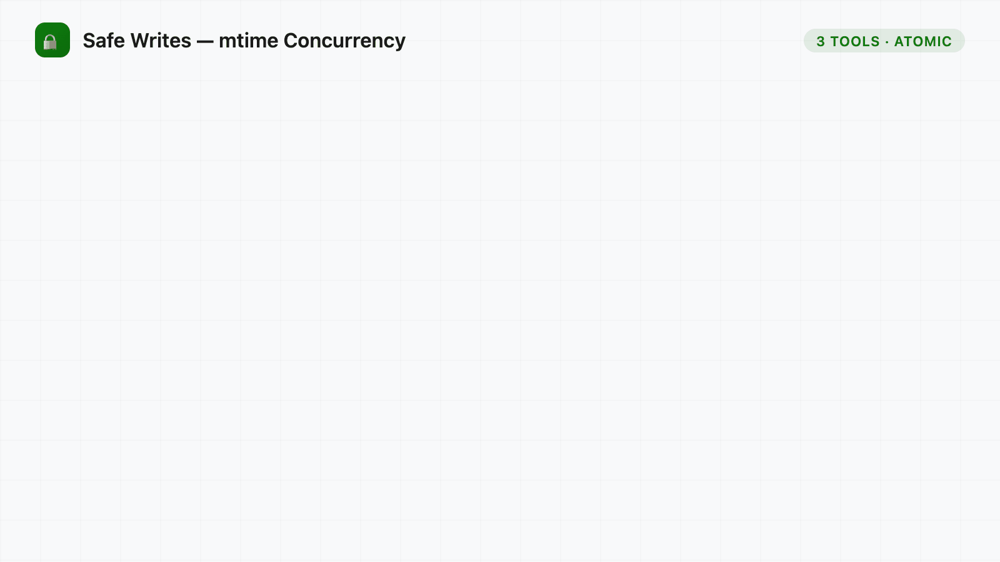
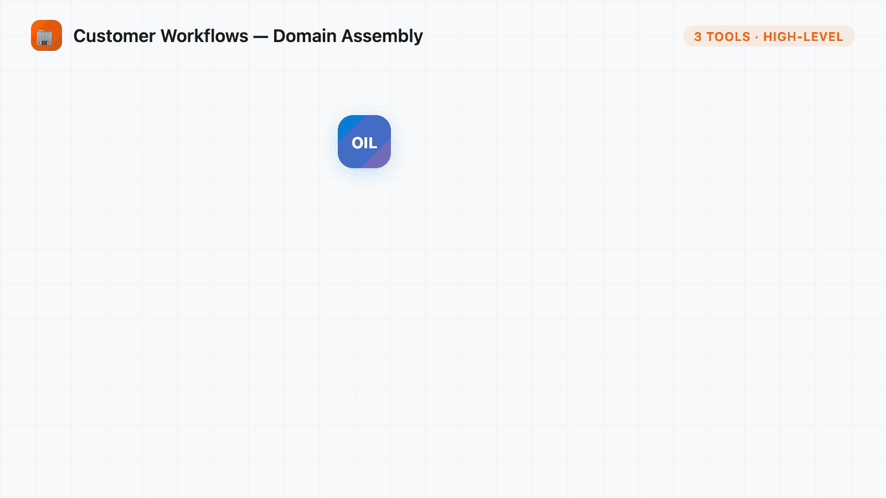
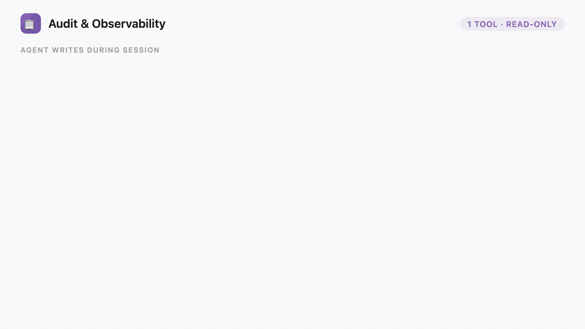

# Obsidian Intelligence Layer (OIL)

**OIL is an [MCP](https://modelcontextprotocol.io/) server that gives AI agents efficient, safe access to an Obsidian vault.** Instead of flooding context with raw file dumps, it provides targeted reads, ranked search, and mtime-safe writes — so the LLM spends its context on reasoning, not data wrangling.

**Node 20+** · **TypeScript** · **ES modules** · **MIT**

<p align="center">
  
</p>

---

## Why OIL?

**The problem:** Your Obsidian vault is your second brain — customer notes, meeting summaries, project docs, action items. When you ask your AI assistant to help ("what are the open action items for Contoso?"), it needs to read your vault.

Without a smart interface, the agent does the dumb thing:
- Dumps 50 full notes into context → burns thousands of tokens
- Searches by grep → misses structure, relationships, and frontmatter
- Writes blindly → risks overwriting your edits mid-session

**The solution:** OIL is a structured interface between your AI and your vault. It speaks [Model Context Protocol](https://modelcontextprotocol.io/) — the protocol AI agents use to discover and call tools. When Copilot or Claude needs something from your vault, it calls OIL's tools instead:

- **Search** returns ranked snippets, not whole files
- **Reads** are section-level — ask for `## Team` and get just that heading
- **Writes** are mtime-checked — the agent can't clobber your edits by accident
- **Domain tools** assemble full customer snapshots, extract CRM identifiers, and surface vault hygiene issues — encoding business logic the LLM would otherwise have to reconstruct from scratch

> **For customer-facing teams:** OIL includes purpose-built tools for account management workflows. If you track customers, opportunities, and meetings in Obsidian, the domain tools (`get_customer_context`, `prepare_crm_prefetch`, `check_vault_health`) are the highest-value part of the set.

---

## What This Is (and Isn't)

**OIL is not a REST API wrapper around Obsidian.** It's an MCP server — it speaks the [Model Context Protocol](https://modelcontextprotocol.io/) over stdio. AI agents connect to it as a tool provider; you don't hit it with curl.

| Without OIL | With OIL |
|---|---|
| Dump full note to context | `read_note_section(path, "Team")` → just the section you need |
| Full-vault file scan for backlinks | `get_related_entities(path)` → graph-traversed refs, capped at 50 |
| Free-text grep across files | `search_vault(query)` → ranked results with snippets, folder + tag filters |
| Blind file overwrite | `atomic_append(path, heading, content, expected_mtime)` → rejected if file changed since last read |
| Manual review for stale notes | `check_vault_health()` → surfaces stale insights, missing IDs, orphaned meetings |
| Manual context assembly per customer | `get_customer_context(customer)` → assembled snapshot: team, meetings, opportunities, action items |

---

## Quick Start

### Prerequisites

- **Node.js ≥ 20**
- An **Obsidian vault** on disk (Obsidian doesn't need to be running — OIL works directly on the files)

### Install and Build

```bash
git clone <repo-url>
cd obsidian-intelligence-layer
npm install
npm run build
```

### Run

```bash
OBSIDIAN_VAULT_PATH=/path/to/your/vault node dist/index.js
```

The server communicates over **stdio**. You don't hit it with curl — an MCP client connects to it.

### Connect to VS Code (Copilot / Claude)

**Option A: Per-workspace** — add to `.vscode/mcp.json` in any workspace:

```json
{
  "servers": {
    "oil": {
      "type": "stdio",
      "command": "node",
      "args": ["dist/index.js"],
      "cwd": "/absolute/path/to/obsidian-intelligence-layer",
      "env": {
        "OBSIDIAN_VAULT_PATH": "/absolute/path/to/your/obsidian/vault"
      }
    }
  }
}
```

**Option B: Global (all workspaces)** — add to `~/.copilot/mcp-config.json` so OIL is available across all Copilot CLI sessions and workspaces:

```json
{
  "mcpServers": {
    "oil": {
      "type": "stdio",
      "command": "node",
      "args": ["/absolute/path/to/obsidian-intelligence-layer/dist/index.js"],
      "env": {
        "OBSIDIAN_VAULT_PATH": "/absolute/path/to/your/obsidian/vault"
      }
    }
  }
}
```

> **Note:** Use absolute paths in `args` since there's no workspace-relative root. The top-level key is `mcpServers` (not `servers` like the workspace config).

Once configured, the agent can call any of OIL's 14 live tools by name.

---

## Tools Reference

OIL exposes **14 live tools** across five categories.

### Core Visibility (1 tool) — Tiny runtime summary

Use this first when a client needs fast runtime state without paying the cost of a detailed audit read.

| Tool | What It Does |
|---|---|
| `get_health` | Returns server identity, live tool-surface counts, index freshness, cache stats, watcher state, and whether audit logs are available. This is the summary visibility tool; use `get_agent_log` only when you need detailed write history. |

### Search & Inspect (6 tools) — Token-efficient reads

All read-only. No confirmation needed.

<p align="center">
  
</p>

| Tool | What It Does |
|---|---|
| `search_vault` | Unified search across lexical and fuzzy tiers, with optional folder and tag filters. Returns ranked results with excerpts. |
| `semantic_search` | Natural-language search combining fuzzy title matching with in-memory content search. Returns ranked results with short snippets. |
| `query_frontmatter` | Lookup notes by frontmatter key and value fragment — resolved from the in-memory graph, no disk scan. Example: find all notes where `tpid` contains `"12345"`. Returns up to 20 paths. |
| `get_note_metadata` | Peek at a note before loading full content — returns frontmatter, timestamps, word count, heading list, and `mtime_ms` (needed for writes). |
| `read_note_section` | Read only a specific heading section from a note. The most token-efficient read — request `## Team` instead of loading a 5,000-word note. |
| `get_related_entities` | Graph traversal from a note — returns linked notes up to N hops away, paths and titles only, capped at 50. Default: 2 hops. |

### Safe Writes (3 tools) — Atomic writes with mtime concurrency

All write tools require `expected_mtime` (from `get_note_metadata`) or check for file existence. If the file has changed since you last read it, the write is rejected immediately.

<p align="center">
  
</p>

| Tool | What It Does |
|---|---|
| `atomic_append` | Append content under a specific heading. Requires `expected_mtime`. Rejected if the file changed since you read it. Returns new `mtime_ms`. |
| `atomic_replace` | Replace entire note content. Same `expected_mtime` check. Use for full-file rewrites when section-level append isn't enough. Returns new `mtime_ms`. |
| `create_note` | Create a new note at a given path. Fails cleanly if the note already exists — use `atomic_replace` to update existing notes. |

### Customer Workflows (3 tools) — Domain-specific assembly

High-level tools that encode business logic the LLM would otherwise need to reconstruct from scratch on every request.

<p align="center">
  
</p>

| Tool | What It Does |
|---|---|
| `get_customer_context` | Assembles a full customer snapshot: frontmatter, opportunities with GUIDs, milestones, team composition, recent meetings, linked people, and open action items. Accepts a customer name or TPID, plus `view=brief|full|write` for compact reads or deterministic write scaffolding. |
| `prepare_crm_prefetch` | Extracts vault-stored CRM identifiers (opportunity GUIDs, TPIDs, account IDs) for one or more customers. Returns structured data with OData filter hints ready for CRM query construction. |
| `check_vault_health` | Scans the vault for stale Agent Insights (>30 days), opportunities or milestones missing IDs, notes without a `## Team` section, and orphaned meeting notes. Returns a prioritized issue list. |

### Audit & Observability (1 tool)

<p align="center">
  
</p>

| Tool | What It Does |
|---|---|
| `get_agent_log` | Read the agent write audit log for a given date (default: today). Every `atomic_append`, `atomic_replace`, and `create_note` call is logged here with timestamp, path, and operation detail. |

### Write Safety Pattern

The write tools use **mtime-based concurrency checks** — no write queues, no approval flows:

```
1. Agent calls get_note_metadata(path) → receives mtime_ms
2. Agent decides to write
3. Agent calls atomic_append(path, heading, content, expected_mtime=mtime_ms)
      │
      ├─ Read current mtime from disk
      │
      ├─ Matches? → Execute write, invalidate cache, return new mtime_ms
      │
      └─ Mismatch? → "Stale write rejected" — agent must re-read and retry
```

If a workflow requires user approval, that's handled by the Copilot UI — the MCP server simply executes or rejects.

---

## Configuration

Create `oil.config.yaml` in your vault root to customize folder layout and field names. Omit it entirely to use sensible defaults. Supports **snake_case YAML** that remaps to camelCase internally.

```yaml
# Folder layout (where things live in your vault)
schema:
  customers_root: "Customers/"
  people_root: "People/"
  meetings_root: "Meetings/"
  projects_root: "Projects/"
  weekly_root: "Weekly/"
  templates_root: "Templates/"
  agent_log: "_agent-log/"
  connect_hooks_backup: ".connect/hooks/hooks.md"
  opportunities_subdir: "opportunities/"
  milestones_subdir: "milestones/"
  insights_subdir: "insights/"

# Frontmatter field names (match your vault conventions)
frontmatter_schema:
  customer_field: "customer"
  tags_field: "tags"
  date_field: "date"
  status_field: "status"
  project_field: "project"
  tpid_field: "tpid"
  accountid_field: "accountid"

# Search and indexing
search:
  graph_index_file: "_oil-graph.json"         # Persisted link graph
  background_index_threshold_ms: 3000         # Background rebuild threshold (ms)

# Write configuration
write_gate:
  diff_format: "markdown"
  log_all_writes: true                        # Log every write to _agent-log/
  batch_diff_max_notes: 50
  auto_confirmed_sections:
    - "Agent Insights"
    - "Connect Hooks"
  auto_confirmed_operations:
    - "log_agent_action"
    - "capture_connect_hook"
    - "patch_note_designated"
```

---

## Project Structure

```
src/
├── index.ts          # Entry point — startup sequence, tool registration, shutdown
├── cli.ts            # CLI wrapper — .env loading, subcommand routing
├── types.ts          # Shared TypeScript types (NoteRef, OilConfig, etc.)
├── config.ts         # Reads oil.config.yaml from vault root; merges with defaults
├── validation.ts     # Input validation — path safety, GUID format, ISO dates
├── vault.ts          # Filesystem read layer — note parsing, frontmatter, sections, wikilinks
├── graph.ts          # GraphIndex — bidirectional link graph, tag index, N-hop traversal
├── cache.ts          # SessionCache — LRU note cache (200 notes, 5min TTL)
├── watcher.ts        # VaultWatcher — chokidar file watcher, invalidates caches on change
├── gate.ts           # Write helpers — appendToSection, executeWrite, audit logging
├── query.ts          # Frontmatter predicate query engine
├── search.ts         # Fuzzy search (fuse.js) + in-memory content search
├── hygiene.ts        # Vault freshness scanning, staleness detection, health scoring
├── correlate.ts      # Entity matching — cross-references external IDs with vault notes
├── tool-responses.ts # Shared MCP JSON response helpers — structured errors, refs, version hints
├── version.ts        # Server identity — name/version shared by runtime and tools
└── tools/
  ├── core.ts       # 1 tool — get_health
    ├── retrieve.ts   # 6 tools — search, semantic search, query, metadata, section reads, related
    ├── write.ts      # 4 tools — atomic_append, atomic_replace, create_note, get_agent_log
    ├── domain.ts     # 3 tools — get_customer_context, prepare_crm_prefetch, check_vault_health
    ├── orient.ts     # (unregistered) Context assembly primitives from earlier design
    └── composite.ts  # (unregistered) Cross-MCP workflow tools from earlier design
```

### What Each Layer Does

| Layer | Role |
|---|---|
| **vault.ts** | Reads markdown files from disk, parses frontmatter + section maps |
| **graph.ts** | Builds a bidirectional link graph from wikilinks across all notes |
| **cache.ts** | LRU cache — avoids re-reading disk across multi-turn conversations |
| **search.ts** | Finds notes by content: fuzzy title match + in-memory body snippet scan |
| **gate.ts** | Section-level appends and full-file writes with audit logging |
| **hygiene.ts** | Domain-aware staleness checks (insights age, missing IDs, orphaned meetings) |
| **validation.ts** | Rejects bad paths, names, and IDs before they hit disk |
| **tools/*.ts** | Exposes everything above as named MCP tools |

---

## How It Works

### Startup Sequence

When `node dist/index.js` runs:

```
1. Read OBSIDIAN_VAULT_PATH env var
2. Load oil.config.yaml (or use defaults)
3. Load graph index from _oil-graph.json (or full-build if first run)
4. Start incremental graph rebuild in background (if persisted index found)
5. Initialize session cache (in-memory, 200-note LRU)
6. Start chokidar file watcher (invalidates caches on vault changes)
7. Register 13 MCP tools (retrieve + write + domain)
8. Connect stdio transport → server ready
```

### Request Flow (Example: read the Team section from a customer note)

```
Agent calls: read_note_section({ path: "Customers/Contoso.md", heading: "Team" })
      │
      ▼
  retrieve.ts handler
      │
      ├─ validation.ts → validateVaultPath()    ← reject traversal attacks, bad chars
      │
      ├─ vault.readNote("Customers/Contoso.md") ← parse file, extract sections map
      │
      ├─ sections.get("Team")                   ← O(1) lookup
      │
      └─ Return JSON: { path, heading, content }
```

The agent gets **just the section it needs** — not the entire note.

---

## Architecture Deep Dive

### Index Stack

OIL maintains in-memory indices so most tool calls resolve in milliseconds:

```
┌──────────────────────────────────────────────────────┐
│  Tier 0: Graph Index (persistent, _oil-graph.json)   │
│  Wikilinks, backlinks, tags, frontmatter per note    │
│  Full rebuild on first run; incremental on startup   │
│  Backlink lookup: O(1)                               │
├──────────────────────────────────────────────────────┤
│  Tier 1: Fuzzy Search Index (in-memory, lazy)        │
│  fuse.js — built on first search, invalidated on     │
│  file change. Subsequent searches: ~10ms             │
├──────────────────────────────────────────────────────┤
│  Tier 2: Session Cache (in-memory, per-connection)   │
│  LRU, 200 notes, 5min TTL — avoids re-reading disk   │
│  across multi-turn conversations                     │
└──────────────────────────────────────────────────────┘
```

### Frontmatter Index

`query_frontmatter` resolves against an in-memory index derived from the graph on each call — mapping every frontmatter key to `{ path, value }` entries across all notes. No disk scan needed, no separate index file.

### File Watcher

`chokidar` watches the vault for changes. When a file changes:

1. Graph index re-indexes that node (rebuild outlinks, recompute backlinks)
2. Session cache invalidates the note entry
3. Fuzzy search index marked dirty (rebuilt on next search call)

### Response Shaping

Every tool response minimizes tokens while maximizing usability:

- **Sections, not full files:** `read_note_section` returns only the heading you asked for
- **Metadata before content:** `get_note_metadata` lets the agent peek (word count, headings) before committing to a full read
- **Snippets, not documents:** search tools return match snippets, not entire notes
- **Capped results:** Search capped at 20, graph traversals at 50 — prevents context blowout
- **mtime in every metadata read:** Included so the agent can chain read → write without an extra round-trip

---

## Development

### Commands

```bash
npm install          # Install dependencies
npm run build        # Compile TypeScript → dist/
npm run dev          # Watch mode (recompiles on change)
npm run lint         # Type-check without emitting
npm start            # Run the server (needs OBSIDIAN_VAULT_PATH)
npm run bench        # Run benchmark suite (vitest)
npm run bench:watch  # Benchmarks in watch mode
```

### Build Requirements

- Node.js ≥ 20
- TypeScript 5.7+
- ES2022 target, Node16 module resolution

### Adding a New Tool

1. Decide which category: `retrieve` (read-only), `write` (modifies vault), or `domain` (business logic assembly).

2. Open the corresponding file in `src/tools/`.

3. Add a `server.registerTool()` call:

```typescript
server.registerTool(
  "my_tool_name",
  {
    // Write the description as a routing signal — tell the LLM WHEN to call this.
    description: "Does X when the agent needs Y. Primary tool for [workflow step].",
    inputSchema: {
      param_name: z.string().describe("What this param means"),
    },
  },
  async ({ param_name }) => {
    const result = { /* ... */ };
    return {
      content: [{ type: "text" as const, text: JSON.stringify(result, null, 2) }],
    };
  },
);
```

4. If the tool writes to the vault, use the mtime concurrency pattern:
   - Accept `expected_mtime` as a required parameter
   - Check the current mtime before writing; reject immediately if mismatched
   - Invalidate the session cache after a successful write
   - Return the new `mtime_ms` so the agent can chain further writes
   - Call `logWrite()` for the audit trail

5. Rebuild: `npm run build`

### Key Conventions

- **Zod v4**: `z.record()` needs two args: `z.record(z.string(), z.unknown())`, not one.
- **ES modules**: All imports use `.js` extensions (`import { foo } from "./bar.js"`).
- **Logging**: Use `console.error()` (not `console.log`) — stdout is reserved for MCP protocol messages.
- **Tool descriptions**: Write them as routing instructions. Answer "When should the agent call this?" not just "What does it do?"

---

## FAQ

### Why MCP instead of a REST API?

MCP is the protocol that AI agents (Copilot, Claude, etc.) use to discover and call tools. A REST API would require the agent to know your endpoint URL, handle auth, and parse responses — MCP handles all of that via the client integration.

### Does Obsidian need to be running?

No. OIL reads/writes the vault folder directly on disk. Obsidian will pick up changes when it's next opened (or immediately if it's running, since it also watches the folder).

### What's the difference between `search_vault` and `semantic_search`?

`search_vault` is the primary search tool — it runs lexical (substring) search first, then falls back to fuzzy title matching, with folder and tag filter support. `semantic_search` is broader: it combines fuzzy title matching with in-memory body snippet scanning for natural-language queries. Both return ranked results with snippets. Neither requires an external API or model download.

### What about CRM integration?

OIL doesn't query CRM directly. It surfaces vault-stored identifiers (opportunity GUIDs, TPIDs, account IDs) through `prepare_crm_prefetch`. The agent takes those IDs and calls a separate CRM MCP (e.g., MSX) itself.

### What happens if I don't create `oil.config.yaml`?

All defaults are used. Customers in `Customers/`, people in `People/`, meetings in `Meetings/`, etc. See the [Configuration](#configuration) section for the full default set.

### How do I see what the agent wrote to my vault?

Use `get_health` first if you only need a quick status check. Use `get_agent_log` when you need the detailed write audit for today (or any specified date in `YYYY-MM-DD` format). Every `atomic_append`, `atomic_replace`, and `create_note` call is logged with timestamp, path, and operation detail.

### Can I undo agent writes?

Writes require a valid mtime check, so accidental stale overwrites are prevented. For rollback, use Obsidian's built-in file recovery or git.
