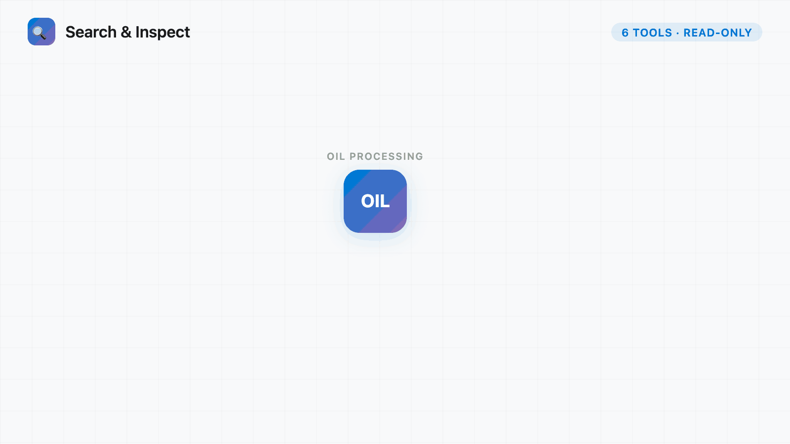
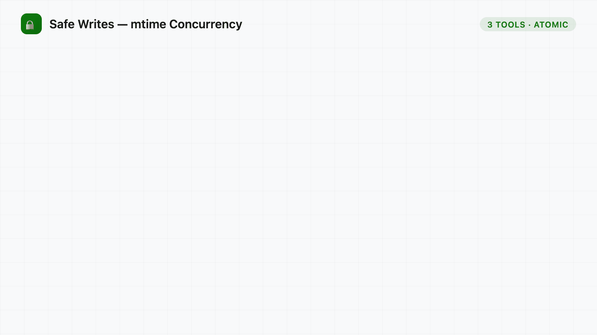
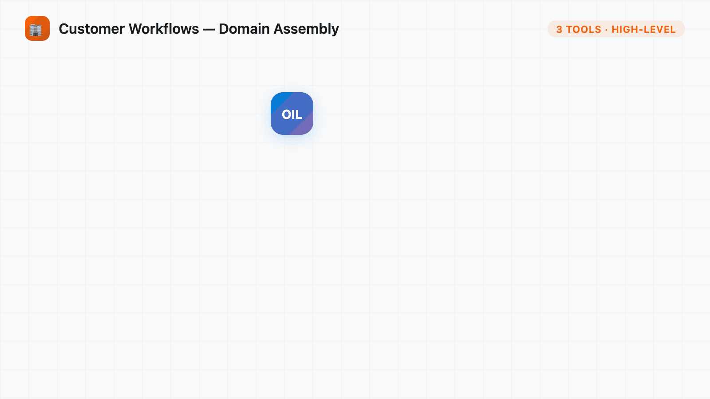
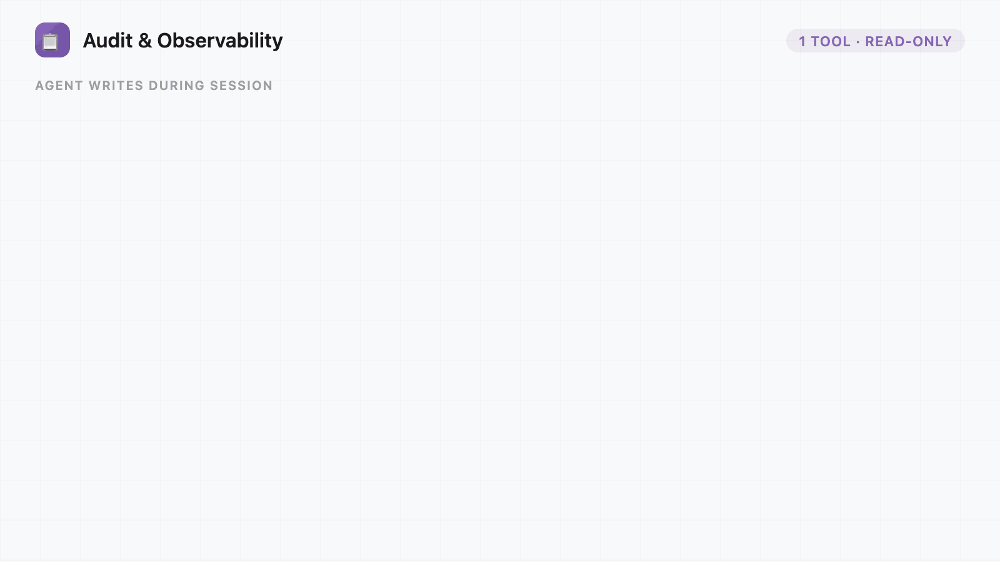

# Obsidian Intelligence Layer (OIL)

**OIL is an [MCP](https://modelcontextprotocol.io/) server that gives AI agents efficient, safe access to an Obsidian vault.** Instead of flooding context with raw file dumps, it provides targeted reads, ranked search, and mtime-safe writes — so the LLM spends its context on reasoning, not data wrangling.

**Node 20+** · **TypeScript** · **ES modules** · **MIT**

<p align="center">
  
</p>

---

## Why OIL?

**The problem:** Your Obsidian vault is your second brain — customer notes, meeting summaries, project docs, action items. When you ask your AI assistant to help ("what are the open action items for Contoso?"), it needs to read your vault.

Without a smart interface, the agent does the dumb thing:
- Dumps 50 full notes into context → burns thousands of tokens
- Searches by grep → misses structure, relationships, and frontmatter
- Writes blindly → risks overwriting your edits mid-session

**The solution:** OIL is a structured interface between your AI and your vault. It speaks [Model Context Protocol](https://modelcontextprotocol.io/) — the protocol AI agents use to discover and call tools. When Copilot or Claude needs something from your vault, it calls OIL's tools instead:

- **Search** returns ranked snippets, not whole files
- **Reads** are section-level — ask for `## Team` and get just that heading
- **Writes** are mtime-checked — the agent can't clobber your edits by accident
- **Domain tools** assemble full customer snapshots, extract CRM identifiers, and surface vault hygiene issues — encoding business logic the LLM would otherwise have to reconstruct from scratch

> **For customer-facing teams:** OIL includes purpose-built tools for account management workflows. If you track customers, opportunities, and meetings in Obsidian, the domain tools (`get_customer_context`, `prepare_crm_prefetch`, `check_vault_health`) are the highest-value part of the set.

---

## What This Is (and Isn't)

**OIL is not a REST API wrapper around Obsidian.** It's an MCP server — it speaks the [Model Context Protocol](https://modelcontextprotocol.io/) over stdio. AI agents connect to it as a tool provider; you don't hit it with curl.

| Without OIL | With OIL |
|---|---|
| Dump full note to context | `read_note_section(path, "Team")` → just the section you need |
| Full-vault file scan for backlinks | `get_related_entities(path)` → graph-traversed refs, no note bodies |
| Free-text grep across files | `search_vault(query)` → BM25-ranked results, escalating to fuzzy then local-embedding semantic matching only when needed |
| Blind file overwrite | `atomic_append(path, heading, content, expected_mtime)` → rejected if file changed since last read |
| Manual review for stale notes | `check_vault_health()` → surfaces stale insights, missing IDs, orphaned meetings |
| Manual context assembly per customer | `get_customer_context(customer)` → assembled snapshot: team, meetings, opportunities, action items |

---

## Quick Start

### Prerequisites

- **Node.js ≥ 20**
- An **Obsidian vault** on disk (Obsidian doesn't need to be running — OIL works directly on the files)
- *Optional:* **[Ollama](https://ollama.com)**, running locally, to enable meaning-based search

That last one is genuinely optional. Without it OIL searches by keyword, exactly
as it always has; with it, `search_vault` can also answer questions phrased in
words your notes never use. Nothing else to install — OIL fetches the embedding
model itself on first run, in the background.

```bash
obsidian-intelligence-layer doctor --vault=/path/to/vault   # tells you where you stand
```

### Install and Build

```bash
git clone <repo-url>
cd obsidian-intelligence-layer
npm install
npm run build
```

### Run

```bash
OBSIDIAN_VAULT_PATH=/path/to/your/vault node dist/index.js
```

Or through the packaged CLI, which also reads `OBSIDIAN_VAULT_PATH` from a `.env` file in the current directory:

```bash
obsidian-intelligence-layer mcp
```

The server communicates over **stdio**. You don't hit it with curl — an MCP client connects to it.

### Check your setup

Before wiring it into a client, confirm what OIL can actually see:

```bash
obsidian-intelligence-layer doctor --vault=/path/to/your/vault
```

```
  ok    vault: /path/to/your/vault
  ok    ollama: reachable at http://127.0.0.1:11434
  ok    model: nomic-embed-text is installed

  effective semantic settings
    enabled   true
    endpoint  http://127.0.0.1:11434
    model     nomic-embed-text
    minScore  0.45
    index     _oil-vectors.json (in the vault root)
```

`doctor` reports the *effective* settings after flags, environment and `oil.config.yaml` have all been resolved, so it answers "why is the semantic tier off?" directly. It exits non-zero when something needs attention.

### Controlling OIL from the client

An MCP client configures a server through `command`, `args` and `env` — not through files inside your vault. Every setting is therefore reachable from both, and resolves in this order:

**CLI flags → environment variables → `oil.config.yaml` → defaults**

| Flag | Environment variable | Purpose |
|---|---|---|
| `--vault=<path>` | `OBSIDIAN_VAULT_PATH` | Vault to serve (required) |
| `--no-semantic` | `OIL_SEMANTIC=off` | Turn the semantic tier off entirely |
| `--semantic-model=<name>` | `OIL_SEMANTIC_MODEL` | Embedding model (default `nomic-embed-text`) |
| `--semantic-endpoint=<url>` | `OIL_SEMANTIC_ENDPOINT` | Ollama base URL (default `http://127.0.0.1:11434`) |
| `--semantic-min-score=<n>` | `OIL_SEMANTIC_MIN_SCORE` | Cosine floor for a hit (default `0.5`) |
| — | `OIL_EXCLUDE_FOLDERS` | Comma-separated folders kept out of results |

So a user who wants lexical-only search adds one line to their client config, with no edit to the vault:

```json
"env": {
  "OBSIDIAN_VAULT_PATH": "/absolute/path/to/vault",
  "OIL_SEMANTIC": "off"
}
```

At runtime, `get_health` reports the tier's live state (`disabled`, `cold`, `indexing`, `ready`, `unavailable`) with a `reason` for the last two — so an agent, not just a human, can tell why a search did or didn't use embeddings.

### Connect to VS Code (Copilot / Claude)

**Option A: Run from GitHub** — add to `.vscode/mcp.json` in any workspace:

```json
{
  "servers": {
    "oil": {
      "type": "stdio",
      "command": "npx",
      "args": [
        "-y",
        "--package=github:JinLee794/Obsidian-Intelligence-Layer#v0.6.0",
        "--",
        "obsidian-intelligence-layer",
        "mcp"
      ],
      "envFile": "${workspaceFolder}/.env"
    }
  }
}
```

The `.env` file must define `OBSIDIAN_VAULT_PATH` with an absolute path. The release tag keeps installs reproducible; update it when upgrading OIL.

**Option B: Run a local checkout** — build the project first, then use:

```json
{
  "servers": {
    "oil": {
      "type": "stdio",
      "command": "node",
      "args": ["dist/index.js"],
      "cwd": "/absolute/path/to/obsidian-intelligence-layer",
      "env": {
        "OBSIDIAN_VAULT_PATH": "/absolute/path/to/your/obsidian/vault"
      }
    }
  }
}
```

**Option C: Global local checkout** — add to `~/.copilot/mcp-config.json` so OIL is available across all Copilot CLI sessions and workspaces:

```json
{
  "mcpServers": {
    "oil": {
      "type": "stdio",
      "command": "node",
      "args": ["/absolute/path/to/obsidian-intelligence-layer/dist/index.js"],
      "env": {
        "OBSIDIAN_VAULT_PATH": "/absolute/path/to/your/obsidian/vault"
      }
    }
  }
}
```

> **Note:** Use absolute paths in `args` since there's no workspace-relative root. The top-level key is `mcpServers` (not `servers` like the workspace config).

Once configured, the agent can call any of OIL's 13 live tools by name.

---

## Tools Reference

OIL exposes **13 live tools** across five categories.

### Core Visibility (1 tool) — Tiny runtime summary

Use this first when a client needs fast runtime state without paying the cost of a detailed audit read.

| Tool | What It Does |
|---|---|
| `get_health` | Returns server identity, live tool-surface counts, index freshness, cache stats, watcher state, and whether audit logs are available. This is the summary visibility tool; use `get_agent_log` only when you need detailed write history. |

### Search & Inspect (5 tools) — Token-efficient reads

All read-only. No confirmation needed.

<p align="center">
  
</p>

| Tool | What It Does |
|---|---|
| `search_vault` | The default search tool. Cascades **exact frontmatter value → BM25 → fuzzy → semantic**, escalating only when a cheaper tier fails to cover the query, then fuses whatever ran. Optional `filter_folder`, `filter_tags`, `limit` (default 10). Response reports `tiers_used`, `escalated`, and `matched_by` per result — including which frontmatter field matched, e.g. `frontmatter:tpid`. |
| `semantic_search` | The semantic tier on its own, for when the caller *knows* it wants meaning rather than wording — conceptual questions, or "what have we discussed like this". Same filters as `search_vault`. Prefer `search_vault` unless the query deliberately shares no vocabulary with its answer; it consults this tier anyway and outranks it on most queries. Because it has no fallback tier, an empty result says whether nothing matched or the tier never ran. |
| `query_frontmatter` | Structured lookup over frontmatter and tags, resolved from the in-memory graph — no disk scan. Four modes: **no args** lists every key with counts (schema discovery); **`key`** lists that key's distinct values; **`key`+`value_fragment`** matches a substring; **`where`** filters on several fields at once (`{ status: "at-risk", tags: ["enterprise"] }`). Supports `folder`, `order_by` (`-` prefix for descending), `limit`. Reports `total_matched` before truncation. |
| `get_note_metadata` | Peek at a note before loading full content — returns frontmatter, timestamps, word count, heading list, and `mtime_ms` (needed for writes). |
| `read_note_section` | Read only a specific heading section from a note. The most token-efficient read — request `## Team` instead of loading a 5,000-word note. If the heading is missing, the error lists `available_headings`. |
| `get_related_entities` | Graph traversal from a note — returns linked notes up to `max_hops` away (default 2), as paths and titles only, never content. |

### Safe Writes (3 tools) — Atomic writes with mtime concurrency

All write tools require `expected_mtime` (from `get_note_metadata`) or check for file existence. If the file has changed since you last read it, the write is rejected immediately.

<p align="center">
  
</p>

| Tool | What It Does |
|---|---|
| `atomic_append` | Append content under a specific heading. Requires `expected_mtime`. Rejected if the file changed since you read it. Returns new `mtime_ms`. |
| `atomic_replace` | Replace entire note content. Same `expected_mtime` check. Use for full-file rewrites when section-level append isn't enough. Returns new `mtime_ms`. |
| `create_note` | Create a new note at a given path. Fails cleanly if the note already exists — use `atomic_replace` to update existing notes. |

### Customer Workflows (3 tools) — Domain-specific assembly

High-level tools that encode business logic the LLM would otherwise need to reconstruct from scratch on every request.

<p align="center">
  
</p>

| Tool | What It Does |
|---|---|
| `get_customer_context` | Assembles a full customer snapshot: frontmatter, opportunities with GUIDs, milestones, team composition, recent meetings, linked people, and open action items. Accepts a customer name or TPID, plus `view=brief\|full\|write` for compact reads or deterministic write scaffolding. Also supports `lookback_days` (default 90), `include_open_items` (default true), `include_similar` (default false), and `assignee` to filter open items. |
| `prepare_crm_prefetch` | Extracts vault-stored CRM identifiers (opportunity GUIDs, TPIDs, account IDs, milestone IDs) for one or more customers. Returns structured data with OData filter hints ready for CRM query construction. |
| `check_vault_health` | Scans the vault for stale Agent Insights (>30 days), opportunities or milestones missing IDs, notes without a `## Team` section, and orphaned meeting notes. Optional `customers` array narrows the scan. Returns a prioritized issue list. |

### Audit & Observability (1 tool)

<p align="center">
  
</p>

| Tool | What It Does |
|---|---|
| `get_agent_log` | Read the agent write audit log for a given date (`YYYY-MM-DD`, default: today). Every `atomic_append`, `atomic_replace`, and `create_note` call is logged here with timestamp, path, and operation detail. |

### Write Safety Pattern

The write tools use **mtime-based concurrency checks** — no write queues, no approval flows:

```
1. Agent calls get_note_metadata(path) → receives mtime_ms
2. Agent decides to write
3. Agent calls atomic_append(path, heading, content, expected_mtime=mtime_ms)
      │
      ├─ Acquire per-path write lock (concurrent writes to one note serialize)
      │
      ├─ Read current mtime from disk
      │
      ├─ Matches? → Execute write, reindex + invalidate cache, return new mtime_ms
      │
      └─ Mismatch? → CONFLICT "Stale write rejected" — agent must re-read and retry
```

mtime comparison allows 1 ms of slack to absorb filesystem precision differences. `create_note` waits for the new file's mtime to stabilise before returning it, so an immediately chained write isn't rejected by Obsidian's own indexing touch.

If a workflow requires user approval, that's handled by the Copilot UI — the MCP server simply executes or rejects.

---

## Configuration

Create `oil.config.yaml` in your vault root to customize folder layout and field names. Omit it entirely to use sensible defaults. Supports **snake_case YAML** that remaps to camelCase internally.

```yaml
# Folder layout (where things live in your vault)
schema:
  customers_root: "Customers/"
  people_root: "People/"
  meetings_root: "Meetings/"
  projects_root: "Projects/"
  weekly_root: "Weekly/"
  templates_root: "Templates/"
  agent_log: "_agent-log/"
  connect_hooks_backup: ".connect/hooks/hooks.md"
  opportunities_subdir: "opportunities/"
  milestones_subdir: "milestones/"
  insights_subdir: "insights/"

# Frontmatter field names (match your vault conventions)
frontmatter_schema:
  customer_field: "customer"
  tags_field: "tags"
  date_field: "date"
  status_field: "status"
  project_field: "project"
  tpid_field: "tpid"
  accountid_field: "accountid"
  title_field: "title"

# Search and indexing
search:
  graph_index_file: "_oil-graph.json"         # Persisted link graph
  background_index_threshold_ms: 3000         # Background rebuild threshold (ms)
  exclude_folders:                            # Kept out of search results
    - "_agent-log/"
    - "Templates/"

# Semantic tier (local Ollama embeddings) — optional, degrades silently
semantic:
  enabled: true                               # false disables the tier outright
  endpoint: "http://127.0.0.1:11434"          # Ollama base URL (loopback)
  model: "nomic-embed-text"                   # Pulled automatically on first run
  index_file: "_oil-vectors.json"             # Persisted vectors
  min_score: 0.5                              # Cosine floor for a hit
  batch_size: 4
  timeout_ms: 15000                           # Per input; a batch gets this x its size

# Audit logging
audit:
  log_all_writes: true                        # Log every write to _agent-log/
```

---

## Project Structure

```
src/
├── index.ts          # Entry point — startup sequence, tool registration, shutdown
├── cli.ts            # CLI wrapper — .env loading, subcommand routing
├── types.ts          # Shared TypeScript types (NoteRef, OilConfig, etc.)
├── config.ts         # Reads oil.config.yaml from vault root; merges with defaults
├── validation.ts     # Input validation — path safety, GUID format, ISO dates
├── vault.ts          # Filesystem read layer — note parsing, frontmatter, sections, wikilinks
├── graph.ts          # GraphIndex — bidirectional link graph, tag index, N-hop traversal
├── cache.ts          # SessionCache — LRU note cache (200 notes, 5min TTL)
├── watcher.ts        # VaultWatcher — chokidar file watcher, invalidates caches on change
├── gate.ts           # Write execution — appendToSection, executeWrite, audit logging
├── query.ts          # Frontmatter predicate query engine
├── search.ts         # Search tiers — exact frontmatter + BM25 lexical + fuzzy (fuse.js)
├── semantic.ts       # Semantic tier — Ollama embeddings, cosine ranking (no dependencies)
├── bm25.ts           # Okapi BM25 index and scorer (no dependencies)
├── frontmatter.ts    # Flattens nested frontmatter into dotted key paths
├── hygiene.ts        # Vault freshness scanning, staleness detection, health scoring
├── correlate.ts      # CRM identifier extraction from customer notes
├── tool-responses.ts # Shared MCP JSON response helpers — structured errors, refs, version hints
├── version.ts        # Server identity — name/version shared by runtime and tools
└── tools/
    ├── core.ts       # 1 tool  — get_health
    ├── retrieve.ts   # 5 tools — search cascade, query, metadata, section reads, related
    ├── write.ts      # 4 tools — atomic_append, atomic_replace, create_note, get_agent_log
    └── domain.ts     # 3 tools — get_customer_context, prepare_crm_prefetch, check_vault_health
```

### What Each Layer Does

| Layer | Role |
|---|---|
| **vault.ts** | Reads markdown files from disk, parses frontmatter + section maps |
| **graph.ts** | Builds a bidirectional link graph from wikilinks across all notes |
| **cache.ts** | LRU cache — avoids re-reading disk across multi-turn conversations |
| **search.ts** | Finds notes by content: exact frontmatter values, BM25-ranked lexical tier, fuzzy title match, semantic tier |
| **semantic.ts** | Local Ollama embeddings — note vectors, brute-force cosine, base64 sidecar, silent degradation |
| **bm25.ts** | Okapi BM25 — IDF, TF saturation, length normalisation, exact-title boost |
| **frontmatter.ts** | Flattens nested frontmatter so custom fields (`opportunities.guid`) are indexable and queryable |
| **gate.ts** | Section-level appends and full-file writes with audit logging |
| **hygiene.ts** | Domain-aware staleness checks (insights age, missing IDs, orphaned meetings) |
| **correlate.ts** | Pulls CRM identifiers (GUIDs, TPIDs, account IDs) out of customer notes |
| **validation.ts** | Rejects bad paths, names, and IDs before they hit disk |
| **tools/*.ts** | Exposes everything above as named MCP tools |

---

## How It Works

### Startup Sequence

When `node dist/index.js` runs:

```
1. Read OBSIDIAN_VAULT_PATH env var
2. Load oil.config.yaml (or use defaults)
3. Load graph index from _oil-graph.json (or full-build if first run)
4. Start incremental graph rebuild in background (if persisted index found)
5. Initialize session cache (in-memory, 200-note LRU)
6. Start chokidar file watcher (invalidates caches on vault changes)
7. Register 13 MCP tools (core + retrieve + write + domain)
8. Connect stdio transport → server ready
```

### Request Flow (Example: read the Team section from a customer note)

```
Agent calls: read_note_section({ path: "Customers/Contoso.md", heading: "Team" })
      │
      ▼
  retrieve.ts handler
      │
      ├─ validation.ts → validateVaultPath()    ← reject traversal attacks, bad chars
      │
      ├─ vault.readNote("Customers/Contoso.md") ← parse file, extract sections map
      │
      ├─ sections.get("Team")                   ← O(1) lookup
      │
      └─ Return JSON: { path, heading, content }
```

The agent gets **just the section it needs** — not the entire note.

---

## Architecture Deep Dive

### Index Stack

OIL maintains in-memory indices so most tool calls resolve in milliseconds:

```
┌──────────────────────────────────────────────────────┐
│  Tier 0: Graph Index (persistent, _oil-graph.json)   │
│  Wikilinks, backlinks, tags, frontmatter per note    │
│  Full rebuild on first run; incremental on startup   │
│  Backlink lookup: O(1)                               │
├──────────────────────────────────────────────────────┤
│  Tier 1a: BM25 Index (in-memory, lazy, zero deps)    │
│  Okapi BM25 postings over title/tags/headings/       │
│  frontmatter/body, plus an exact whole-value index   │
│  for identifiers. Patched per changed note           │
├──────────────────────────────────────────────────────┤
│  Tier 1b: Fuzzy Search Index (in-memory, lazy)       │
│  fuse.js over title/tags/headings — typo tolerance.  │
│  Patched per changed note; rebuilt outright once a   │
│  delta exceeds 5% of the vault. Bodies are left to   │
│  BM25. Subsequent searches: ~10ms                    │
├──────────────────────────────────────────────────────┤
│  Tier 1c: Vector Index (in-memory, _oil-vectors.json)│
│  One normalised embedding per note from local        │
│  Ollama; brute-force cosine, no ANN needed below     │
│  ~100k notes. Re-embeds only changed notes, in the   │
│  background. Absent Ollama ⇒ tier disables itself    │
├──────────────────────────────────────────────────────┤
│  Tier 2: Session Cache (in-memory, per-connection)   │
│  LRU, 200 notes, 5min TTL — avoids re-reading disk   │
│  across multi-turn conversations                     │
└──────────────────────────────────────────────────────┘
```

### Frontmatter Index

`query_frontmatter` builds facets from the graph on each call — every frontmatter key mapped to its distinct values and the notes carrying them. No disk scan, no separate index file.

Because the facets are computed rather than configured, the tool can answer *"what can I filter on?"* before it answers *"which notes match?"* — so an agent can reach `status: at-risk` without being told in advance that `status` exists. Predicate queries (`where`) delegate to the engine in [src/query.ts](src/query.ts), which handles multi-field matching, all-of tag matching, folder scoping, and ordering.

```
query_frontmatter()                                  → keys: status(7 notes), tags(12), customer(5) …
query_frontmatter(key: "status")                     → completed(3) active(2) at-risk(1) …
query_frontmatter(where: { status: "at-risk" })      → Customers/Northwind.md
```

### File Watcher

`chokidar` watches the vault for changes. When a file changes:

1. Graph index re-indexes that node (rebuild outlinks, recompute backlinks), bumps its version, and records the path in a bounded mutation log
2. Session cache invalidates the note entry
3. On the next search, each derived index asks `graph.changesSince(itsVersion)` and patches just those notes — BM25 re-indexes the changed documents, the fuzzy index removes and re-adds them, and the semantic tier re-embeds only those whose text hash moved
4. When the delta is unavailable (the log has rolled over, or the graph was rebuilt wholesale) the index falls back to a full build

### Response Shaping

Every tool response minimizes tokens while maximizing usability:

- **Sections, not full files:** `read_note_section` returns only the heading you asked for
- **Metadata before content:** `get_note_metadata` lets the agent peek (word count, headings) before committing to a full read
- **Snippets, not documents:** search tools return match snippets, not entire notes
- **Bounded results:** search tools default to 10 results; `query_frontmatter` returns at most 20 paths; graph traversal returns refs only
- **Response profiles:** `get_customer_context` supports `brief`/`full`/`write` so the agent pays only for the detail it needs
- **mtime in every metadata read:** Included so the agent can chain read → write without an extra round-trip
- **Stable references:** every result carries a `ref` (`path` or `path#heading`) and writes/reads return `version` (= `mtime_ms`)
- **Structured errors:** failures return an `error_code` (`INVALID_INPUT`, `NOT_FOUND`, `CONFLICT`, `PERMISSION_DENIED`, …) plus `agent_guidance` with `retryable`, `next_step`, and `suggested_tools`

---

## Development

### Commands

```bash
npm install           # Install dependencies
npm run build         # Compile TypeScript → dist/
npm run dev           # Watch mode (recompiles on change)
npm run lint          # Type-check without emitting
npm start             # Run the server (needs OBSIDIAN_VAULT_PATH)
npm test              # Run the vitest suite
npm run test:perf     # Wall-clock latency ceilings (run on an idle machine)
npm run test:package  # Pack, install, and smoke-test the release artifact
npm run test:ux       # Install the tarball and check the setup experience
npm run check:release # lint + test + package smoke (runs on publish)
npm run bench         # Run benchmark suite (vitest bench)
npm run bench:watch   # Benchmarks in watch mode
npm run bench:check   # Compare benchmarks against bench/baseline.json
npm run bench:baseline # Refresh bench/baseline.json
```

Standalone harnesses (run against `dist/`, so build first):

```bash
node bench/index-liveness.mjs [notes]   # End-to-end: watcher + tools + every index
node bench/eval-golden.mjs              # Retrieval quality against a golden set
node bench/semantic-probe.mjs           # Evaluate the semantic tier on a real vault
node bench/semantic-eval.mjs [notes...] # Semantic tier at scale; recall@10 with live Ollama
node bench/semantic-live-check.mjs      # Real MCP server + real Ollama, paraphrase queries
node bench/embed-latency.mjs [vault]    # Embed cost by batch size, on your own notes
node bench/rebuild-cost.mjs [notes]     # Index update overhead after a single edit
node bench/tier-breakdown.mjs [notes]   # Per-tier query cost by query length
node bench/ranking-strategies.mjs       # Compare fusion policies on one set of candidates
```

### Measuring retrieval quality

`bench/eval-golden.mjs` scores search against a static set of scenarios with
known answers, so quality is a number that can be compared across changes rather
than an impression formed from spot checks.

```bash
node bench/eval-golden.mjs --dataset=bench/datasets/fixture.golden.json
node bench/eval-golden.mjs --dataset=... --baseline   # record current scores
node bench/eval-golden.mjs --dataset=... --compare    # exit 1 on regression
```

Each case names a query, the notes that should answer it, and — importantly —
which tiers may run. `forbidTiers` is what keeps the cheap path honest: an
identifier lookup that quietly starts paying for an embedding round trip is a
regression even when its results are unchanged.

```json
{
  "id": "tpid-northwind",
  "scenario": "identifier",
  "query": "TP-500600",
  "relevant": ["Customers/Northwind.md"],
  "primary": "Customers/Northwind.md",
  "expectTiers": ["frontmatter"],
  "forbidTiers": ["semantic"]
}
```

Scenarios are grouped so a change that helps paraphrase recall while breaking
identifier lookups shows up as exactly that, instead of averaging out. Reported
metrics are hit rate, MRR, recall, primary accuracy and tier routing.

To score your own vault, copy the fixture dataset and point `vault` at it.

### Comparing ranking policies

The golden set scores whatever the server currently does. It cannot say whether
a *different* combining rule would do better, because changing one means
rebuilding and re-running everything — and any difference then mixes up ranking
changes with retrieval changes.

`bench/ranking-strategies.mjs` separates the two. It runs each tier once per
query, then scores several combining rules over that one fixed candidate set, so
the only variable is the ranking policy:

```bash
node bench/ranking-strategies.mjs --dataset=bench/datasets/fixture.golden.json
node bench/ranking-strategies.mjs --dataset=... "--detail=a,b"  # per-case ranks
```

Use `--detail` before acting on a small gap. A headline MRR difference of a few
points can be one lucky case, and the per-case ranks say which it is.

What it measured on a 360-note vault, against the same 15 queries:

| strategy | hit rate | MRR | recall |
| --- | --- | --- | --- |
| rrf coverage (k=10) | 93% | 0.707 | 78% |
| rrf coverage (k=60) | 93% | 0.665 | 78% |
| score blend coverage | 93% | 0.665 | 78% |
| rrf equal (k=60) | 87% | 0.655 | 72% |
| lexical only | 60% | 0.522 | 57% |
| semantic only | 60% | 0.419 | 45% |
| fuzzy only | 40% | 0.400 | 40% |

Three things follow. Fusing beats standardising on any single tier by a wide
margin — the best single tier finds an answer for 60% of queries where fusion
finds one for 93%, and the tiers fail on *different* queries, which is the whole
reason combining them pays. Normalising scores onto a common scale performs
identically to fusing ranks, so it buys nothing for the extra assumption that
the scores are comparable at all. And weighting by query coverage beats treating
the tiers as equals, which is what motivated the smaller `k`: once tiers are
weighted by evidence, damping their internal ordering as well discards signal
twice.
Anything matching `bench/datasets/*.local.json` is gitignored, because a golden
set built from a real vault contains note paths you probably do not want in a
public repository.

`semantic-live-check` is the one that needs Ollama actually running. It spawns
the packaged stdio server against a copy of the fixture vault, waits for the
background embed to finish, then asks questions through `search_vault` that
share no vocabulary with the notes that answer them — so a lexical hit would be
a coincidence rather than a pass. It also asserts that an exact entity query is
still answered by the lexical tiers alone.

### How the optional semantic tier is packaged

The package has one job it must never fail: installing. Ollama is not an npm
dependency and cannot become one, so the semantic tier is discovered at runtime
rather than installed alongside the code. That gives three distinct layers:

| Layer | Mechanism | Fails how? |
|---|---|---|
| Install | Plain npm package, zero native dependencies, no postinstall | Cannot fail on a missing Ollama — it is never referenced at install time |
| Configure | `--no-semantic` / `OIL_SEMANTIC=off` in the MCP client config | Unparseable values are ignored with a warning, never guessed |
| Run | Probe Ollama on first use; auto-pull the model; degrade on failure | Reports `unavailable` with a reason; search continues lexically |

`npm run check:release` proves the first and third against the **packed tarball**,
not the working tree: it packs, installs into a scratch consumer project, and
connects a real MCP client twice — once with the tier off, and once with it on
but pointed at an unreachable endpoint. Both must initialize and answer a search.
That second case is the one every existing install hits, so it is the
backwards-compatibility guarantee expressed as a test.

### Build Requirements

- Node.js ≥ 20
- TypeScript 5.7+
- ES2022 target, Node16 module resolution

### Adding a New Tool

1. Decide which category: `retrieve` (read-only), `write` (modifies vault), or `domain` (business logic assembly).

2. Open the corresponding file in `src/tools/`.

3. Add a `server.registerTool()` call:

```typescript
server.registerTool(
  "my_tool_name",
  {
    // Write the description as a routing signal — tell the LLM WHEN to call this.
    description: "Does X when the agent needs Y. Primary tool for [workflow step].",
    inputSchema: {
      param_name: z.string().describe("What this param means"),
    },
  },
  async ({ param_name }) => {
    const result = { /* ... */ };
    return {
      content: [{ type: "text" as const, text: JSON.stringify(result, null, 2) }],
    };
  },
);
```

4. If the tool writes to the vault, use the mtime concurrency pattern:
   - Accept `expected_mtime` as a required parameter
   - Check the current mtime before writing; reject immediately if mismatched
   - Invalidate the session cache after a successful write
   - Return the new `mtime_ms` so the agent can chain further writes
   - Call `logWrite()` for the audit trail

5. Update the tool-surface counters, which are asserted in tests:
   - `LIVE_TOOL_SURFACE` in [src/tools/core.ts](src/tools/core.ts) (reported by `get_health`)
   - The inline snapshot and count in [src/__tests__/tool-surface.test.ts](src/__tests__/tool-surface.test.ts)

6. Rebuild and verify: `npm run build && npm test`

### Key Conventions

- **Zod v4**: `z.record()` needs two args: `z.record(z.string(), z.unknown())`, not one.
- **ES modules**: All imports use `.js` extensions (`import { foo } from "./bar.js"`).
- **Logging**: Use `console.error()` (not `console.log`) — stdout is reserved for MCP protocol messages.
- **Tool descriptions**: Write them as routing instructions. Answer "When should the agent call this?" not just "What does it do?"

---

## FAQ

### Why MCP instead of a REST API?

MCP is the protocol that AI agents (Copilot, Claude, etc.) use to discover and call tools. A REST API would require the agent to know your endpoint URL, handle auth, and parse responses — MCP handles all of that via the client integration.

### Does Obsidian need to be running?

No. OIL reads/writes the vault folder directly on disk. Obsidian will pick up changes when it's next opened (or immediately if it's running, since it also watches the folder).

### What happened to `semantic_search`?

It was removed, then reinstated — as a different tool. The old one was a misnomer: despite the name it ran fuzzy title matching plus a substring scan over the first 10 KB of each note, with no notion of meaning. That version is gone for good, and real semantic retrieval now lives *inside* `search_vault` as the last tier (see below).

`semantic_search` now exposes that tier directly, for queries where you know you want meaning rather than wording. It is not the default, and deliberately so: an oracle allowed to pick the single best tier per query scores the same hit rate and recall as fusing all of them, so choosing a tier yourself cannot surface notes the cascade would miss — while choosing *wrong* drops hit rate from 93% to 60%.

`search_vault` cascades through four tiers, escalating only when a cheaper one fails:

```
search_vault(query)
      │
      ├─ Tier 0: exact frontmatter value — whole-value equality on any field
      │          (skipped when the query names a note, so "Contoso" still
      │           resolves to the note titled Contoso)
      │
      ├─ Tier 1: BM25 keyword ranking (~3ms, always runs)
      │     │
      │     └─ Top hit covers every query term, and enough results? → return
      │
      ├─ Tier 2: fuzzy matching — recovers typos and near-miss titles
      │
      ├─ Tier 3: semantic — local embeddings, for notes that share no words
      │          with the query at all (skipped when Ollama isn't running)
      │
      └─ Fuse whatever ran with reciprocal rank fusion → return
```

Escalation keys on **term coverage, not result count**. BM25 will happily return a full page of notes that each matched one word of a three-word query — "enough results" says nothing about whether any of them answered the question. When no result covers the whole query, the fuzzy and semantic tiers run and all rankings are fused.

The tiers have deliberately disjoint jobs: BM25 owns exact terms and identifiers, fuzzy owns misspelled names, semantic owns meaning. That is also why the fuzzy tier indexes only titles, tags and headings — bodies belong to BM25, and indexing them twice cost latency without adding recall.

### How do I turn on the semantic tier?

Install [Ollama](https://ollama.com) and make sure it's running. That's the whole setup — OIL pulls the embedding model itself on first run and needs no extra npm package, native module, or vector database.

```bash
ollama serve      # if it isn't already running as a service
```

Everything else is automatic:

- Vectors are embedded in the background after startup, so the server is never blocked by a cold index or a model download.
- They persist to `_oil-vectors.json` in your vault, so a restart re-embeds nothing.
- Only notes whose text actually changed are re-embedded.
- Nothing leaves your machine — the default endpoint is `127.0.0.1`.

**If Ollama isn't running, nothing breaks.** The tier reports itself unavailable and `search_vault` serves the lexical tiers exactly as before. Run `obsidian-intelligence-layer doctor` to see the current state, or check `get_health`:

```json
{ "semantic": { "status": "ready", "model": "nomic-embed-text",
                "note_count": 1240, "dimensions": 768, "reason": null } }
```

`status` is one of `disabled`, `cold`, `indexing`, `ready`, or `unavailable` — with `reason` explaining the last two.

To turn it off entirely, set `OIL_SEMANTIC=off` in your client config, pass `--no-semantic`, or set `semantic.enabled: false` in `oil.config.yaml`.

### Why isn't Ollama bundled with the package?

Because it can't be, without breaking the install for everyone who doesn't want it. Ollama is a native application of roughly a gigabyte; pulling it from an npm `postinstall` would mean a native build step, and that is precisely what makes packages fail under pnpm's build-script policy and under `npx --package=github:...`. An earlier in-process embedding backend was removed for exactly this reason: it measured 371 MB across 50 packages and was blocked by default.

So the dependency is inverted. OIL ships with **zero native dependencies** and treats Ollama as an optional local service it can discover:

- Not installed, or not running? The tier disables itself and search runs lexically. No error, no failed startup.
- Running, but the model is missing? OIL pulls it over the Ollama HTTP API on first use, in the background.
- Don't want it at all? One environment variable in your client config.

The cost of that choice is one manual step — installing Ollama — in exchange for an npm package that always installs cleanly and a server that always starts.

**Measured on a live `nomic-embed-text`:** embedding runs at roughly 90-110 ms per note, so a 1,000-note vault takes about two minutes to index the first time. That happens in the background and only once; restarts reuse the sidecar and re-embed nothing. Ranking is unaffected by it — cosine over 1,000 vectors is ~2 ms.

The response tells you what actually happened, including which field matched:

```json
{ "tiers_used": ["frontmatter"],
  "escalated": null,
  "results": [{ "matched_by": ["frontmatter:tpid"], ... }] }
```

That attribution matters: `ACC-NORTHWIND-001` reports `frontmatter:accountid`, while `NORTHWIND-001` reports plain `lexical` — so a real identifier hit is distinguishable from a note that merely shares a word with the query.

### What about CRM integration?

OIL doesn't query CRM directly. It surfaces vault-stored identifiers (opportunity GUIDs, TPIDs, account IDs) through `prepare_crm_prefetch`. The agent takes those IDs and calls a separate CRM MCP (e.g., MSX) itself.

### What happens if I don't create `oil.config.yaml`?

All defaults are used. Customers in `Customers/`, people in `People/`, meetings in `Meetings/`, etc. See the [Configuration](#configuration) section for the full default set.

### How do I see what the agent wrote to my vault?

Use `get_health` first if you only need a quick status check. Use `get_agent_log` when you need the detailed write audit for today (or any specified date in `YYYY-MM-DD` format). Every `atomic_append`, `atomic_replace`, and `create_note` call is logged with timestamp, path, and operation detail.

### Can I undo agent writes?

Writes require a valid mtime check, so accidental stale overwrites are prevented. For rollback, use Obsidian's built-in file recovery or git.
