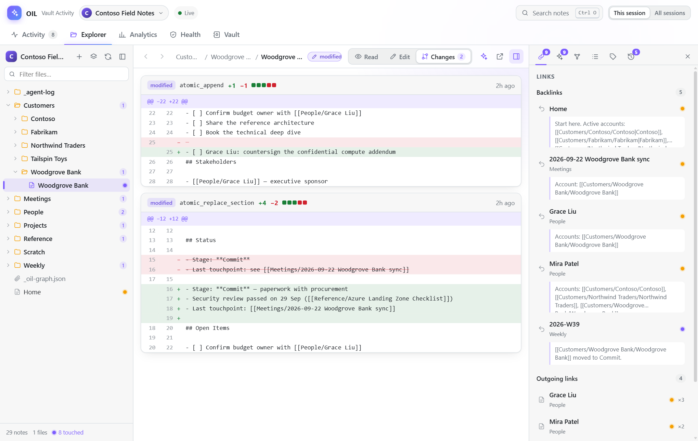
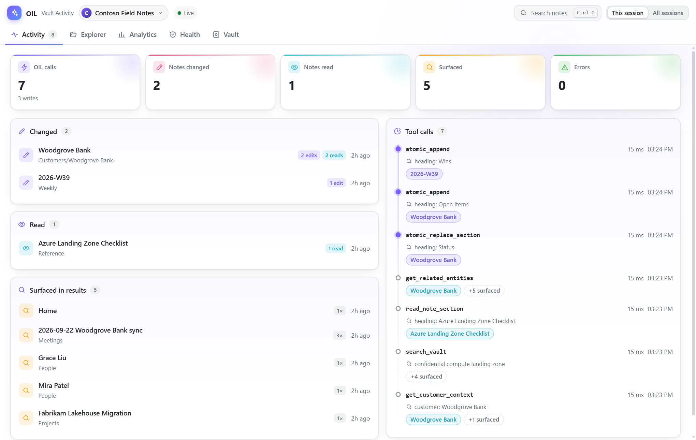
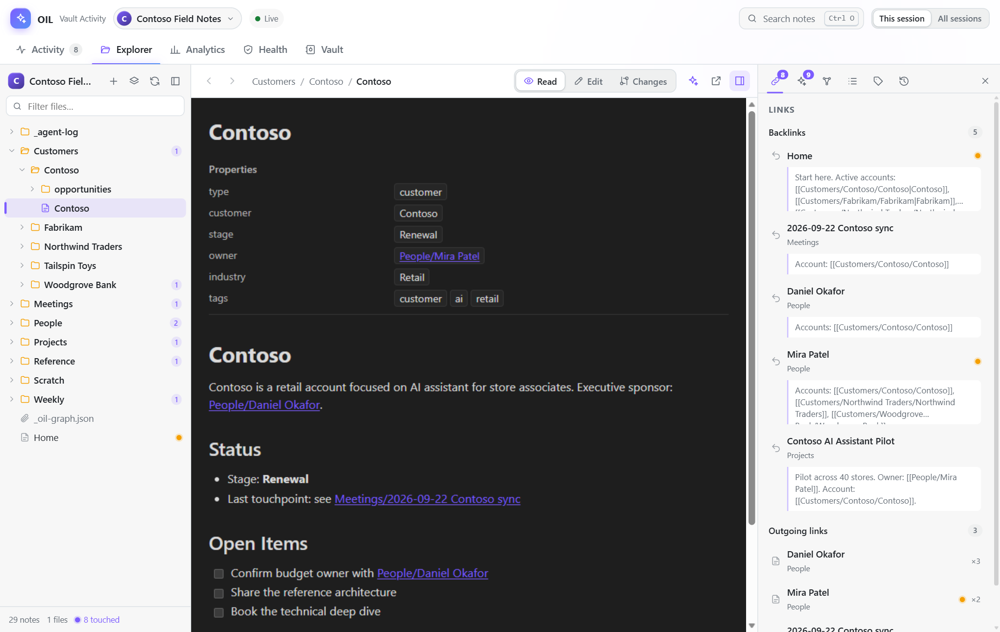
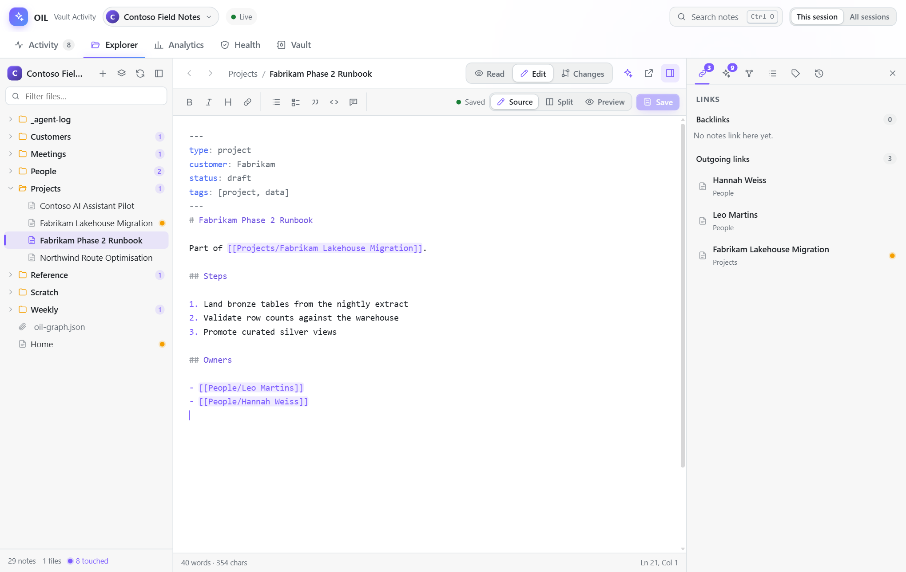
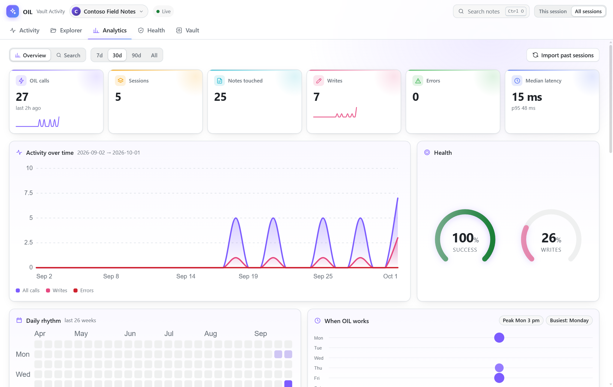
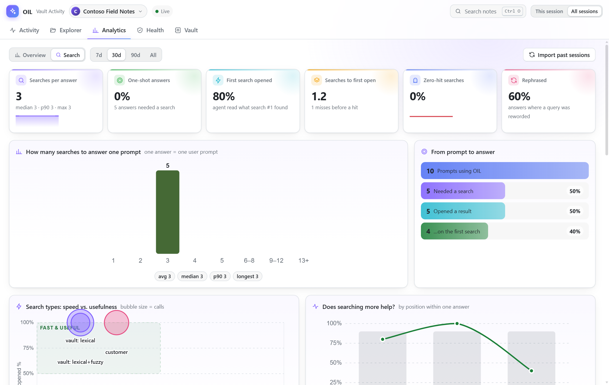
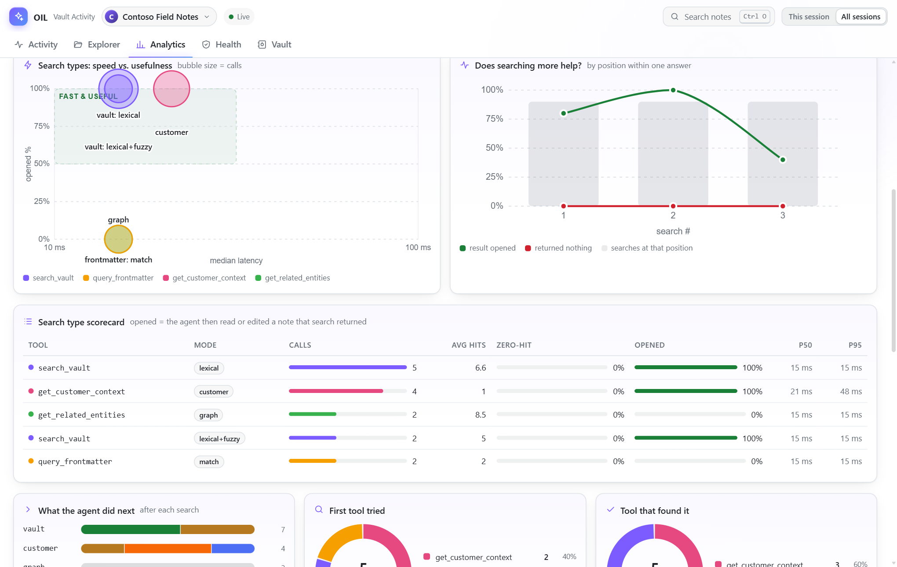
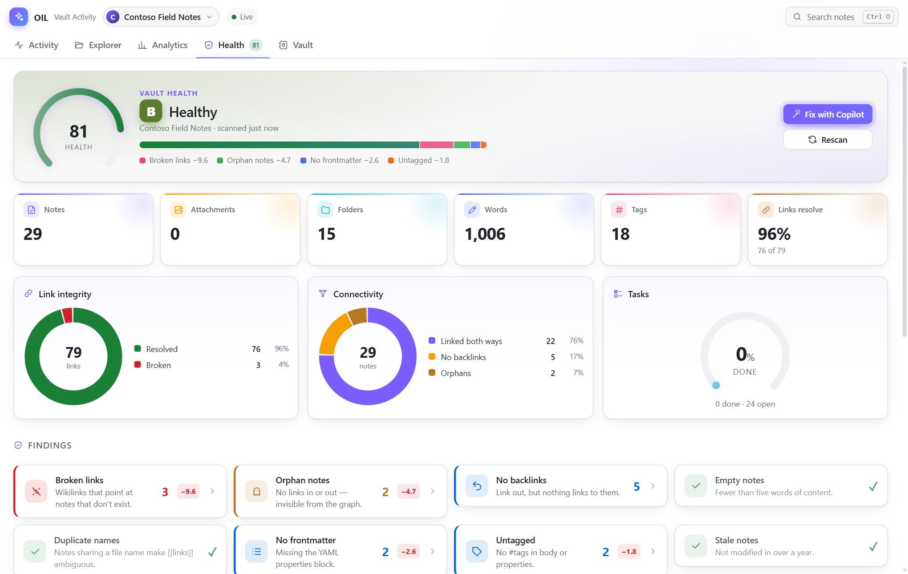
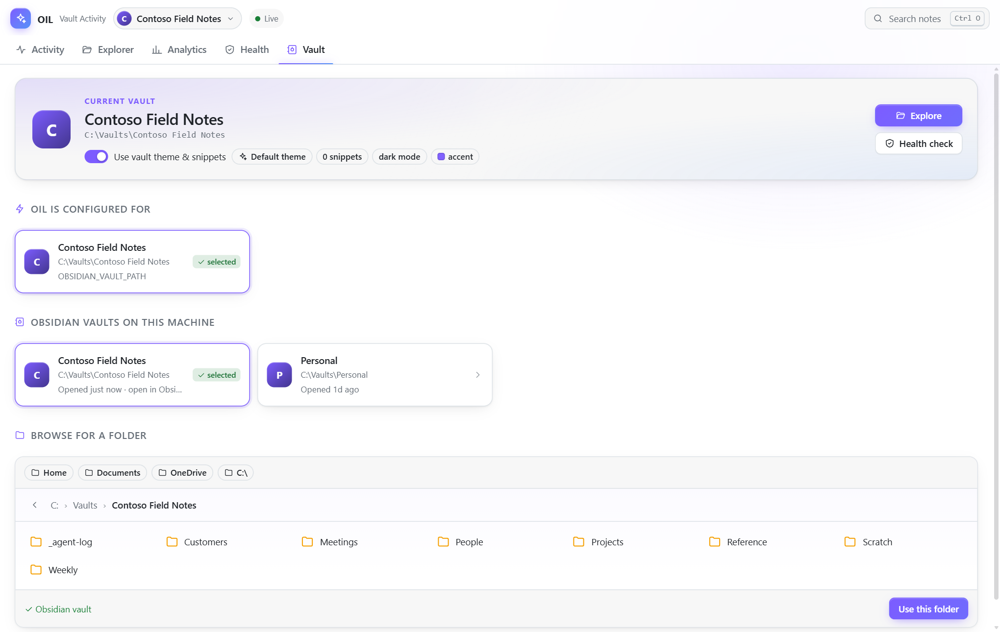

# `oil-vault-kit` — Obsidian Intelligence Layer Copilot plugin

One-command install of the [Obsidian Intelligence Layer](https://github.com/JinLee794/Obsidian-Intelligence-Layer)
MCP server, plus a setup skill and a canvas that shows what the agent did in your vault.

## What the plugin contains

| Component | Name | Purpose |
|---|---|---|
| MCP server | `oil` | 16 tools over an Obsidian vault: tiered search, graph traversal, mtime-guarded writes, archival, audit log |
| Skill | `oil-setup` | Diagnosing a server that did not start, and the optional Ollama tier |
| Canvas extension | `oil-canvas` | Side panel showing which notes OIL changed, read, or surfaced in a session, with diffs and analytics — see [Vault activity canvas](#vault-activity-canvas) |

**One skill, deliberately.** The tools already document themselves — descriptions
say when to call them, parameter schemas explain each option, and a failed write
returns `agent_guidance.next_step` naming the exact recovery sequence. A skill
restating any of that would cost context to say something twice, and could drift
out of sync with it. `oil-setup` covers only what tool discovery cannot reach:
the states where there are no tools to consult, and the fixes that live in your
shell rather than in the vault.

## Install

```bash
copilot plugin marketplace add JinLee794/Obsidian-Intelligence-Layer
copilot plugin install oil-vault-kit@obsidian-intelligence-layer
```

Or install the plugin directly, without registering the marketplace:

```bash
copilot plugin install JinLee794/Obsidian-Intelligence-Layer:plugins/oil-vault-kit
```

Upgrading from an install named `obsidian-intelligence-layer@oil-marketplace` (0.8.1 or earlier)?
Uninstall it and remove that marketplace first, so the server and canvas aren't loaded twice:

```bash
copilot plugin uninstall obsidian-intelligence-layer@oil-marketplace
copilot plugin marketplace remove oil-marketplace
```

## Required configuration

The plugin's MCP server reads **`OBSIDIAN_VAULT_PATH`** from your environment.
Set it to the absolute path of your vault before starting a session — Obsidian
itself does not need to be running.

```powershell
# Windows (persistent)
setx OBSIDIAN_VAULT_PATH "C:\path\to\your\vault"
```

```bash
# macOS / Linux — add to your shell profile
export OBSIDIAN_VAULT_PATH="/absolute/path/to/your/vault"
```

Verify before opening a session:

```bash
npx -y --package=github:JinLee794/Obsidian-Intelligence-Layer#v0.8.4 -- \
  obsidian-intelligence-layer doctor --vault="$OBSIDIAN_VAULT_PATH"
```

Keep the `#v...` pin: without it `npx` resolves the default branch, which may not
carry the `doctor` subcommand yet.

> MCP servers are spawned once, at session start. Setting
> `OBSIDIAN_VAULT_PATH` inside a running session does nothing — restart the
> terminal and the session after changing it.

## The Ollama dependency is optional

OIL's fourth search tier embeds notes locally through [Ollama](https://ollama.com)
so `search_vault` can answer questions phrased in words the notes never use.

**It is not required, and it is not bundled.** Ollama is a native ~1 GB
application; pulling it from an npm `postinstall` would add a native build step
and break installs for everyone who does not want it. So OIL ships zero native
dependencies and discovers Ollama at runtime:

| State | Effect |
|---|---|
| Ollama not installed or not running | Semantic tier reports `unavailable`; `search_vault` serves the keyword tiers. **Nothing errors.** |
| Ollama running, model missing | OIL pulls `nomic-embed-text` over Ollama's HTTP API on first use, in the background |
| Ollama running, model present | Vectors build in the background and persist to `_oil-vectors.json` in the vault |
| Not wanted at all | Set `OIL_SEMANTIC=off` in your environment |

Nothing leaves the machine: the default endpoint is `127.0.0.1:11434`.

To turn it on:

```bash
ollama serve                    # if not already running as a service
ollama pull nomic-embed-text    # optional — OIL pulls it itself on first use
```

Ask the agent for `get_health` at any point; `semantic.status` is one of
`disabled`, `cold`, `indexing`, `ready`, or `unavailable`, with a `reason` for
the last two and a `remedy` naming the fix.

There is no `setup` tool, by design: installing Ollama is a ~1 GB native install
that belongs to you and your shell's approval flow, not to a tool an LLM can
decide to call. OIL reports what is wrong and what fixes it.

## Tuning the tier

The plugin's `.mcp.json` deliberately references **one** variable,
`OBSIDIAN_VAULT_PATH`. Everything else lives in `oil.config.yaml` in your vault
root, which survives plugin updates and needs no environment plumbing:

```yaml
semantic:
  enabled: true                        # false disables the tier outright
  endpoint: "http://127.0.0.1:11434"   # Ollama base URL (loopback)
  model: "nomic-embed-text"            # pulled automatically on first run
  min_score: 0.5                       # cosine floor for a hit
  timeout_ms: 15000
```

Changing `model` changes the vector dimensions, so `_oil-vectors.json` is
re-embedded from scratch.

The equivalent environment variables — `OIL_SEMANTIC`, `OIL_SEMANTIC_MODEL`,
`OIL_SEMANTIC_ENDPOINT`, `OIL_SEMANTIC_MIN_SCORE`, `OIL_EXCLUDE_FOLDERS` — still
win over the YAML when the server process can see them, and remain the right
mechanism for a hand-written `mcp-config.json`. Under the plugin, prefer the
YAML.

## Vault activity canvas

The plugin also ships a canvas extension, **OIL Vault Activity** (`oil-canvas`).
It shows what OIL did to your vault in the current session.



**Get started**

1. Install the plugin and set `OBSIDIAN_VAULT_PATH` (see [Install](#install)).
2. In a Copilot session, in a host that renders canvases such as the GitHub
   Copilot app, ask: *"Open the OIL Vault Activity canvas."*
3. The first time, it opens on the **Vault** tab. Pick the vault OIL is
   configured for, one Obsidian already knows about, or browse to a folder.
4. Work as usual. Every OIL call shows up live.

| | |
|---|---|
|  **Activity**: notes changed, read and surfaced, plus every tool call |  **Explorer**: file tree, your vault theme, backlinks and related notes |
|  **Editor**: markdown with `[[` autocomplete and conflict-safe saves |  **Analytics**: activity, latency, rhythm and health across sessions |
|  **Search**: how many searches each answer took |  **Search types**: speed vs. usefulness per strategy |
|  **Health**: hygiene score, findings and **Fix with Copilot** |  **Vault**: pick a known vault or browse for one |

*Screenshots use a fictional demo vault.*

### What each tab does

- **Activity**: notes OIL *changed*, *read*, and *surfaced* in search results.
  Writes that OIL rejected (for example an mtime conflict) are flagged as failed
  rather than counted as changes. Every OIL tool call is listed with its latency.
- **Explorer**: an Obsidian-style workspace.
  - A file tree of the whole vault, with OIL-touched notes marked.
  - Notes render in **your vault's own theme and enabled CSS snippets** from
    `.obsidian/`. Clicking a `[[wikilink]]` or `#tag` navigates the way it does
    in Obsidian; back and forward work with Alt+←/→, and hovering a link shows
    a preview.
  - A side panel shows **Links** (backlinks, outgoing and unresolved),
    **Related** notes (shared links, tags and co-citations), a local **Graph**
    (1–3 hops), the **Outline**, **Properties**, and the note's OIL **History**.
  - The **Changes** tab shows a line-level diff for every write.
  - Ctrl+O opens a quick switcher that can also create notes.
  - **Open in Obsidian** jumps to the note in the real app.
  - **Other files preview in place.** PDFs open in the built-in viewer; HTML
    renders sandboxed with scripts off (remote images and styles are opt-in);
    images, audio and video play natively. `.pptx`, `.docx` and `.xlsx`
    show as slide cards with speaker notes, a Word-style page, or sheet
    tabs. CSV renders as a table and JSON or text as code. Files protected
    by a sensitivity label, and legacy formats, show **Open externally**,
    which opens them in their default app.
- **Editing**: Ctrl+E edits the current note, with Edit, Split or Preview
  modes.
  - The editor has markdown syntax highlighting and `[[` link autocomplete,
    and it continues lists.
  - Ctrl+S saves. If the file changed on disk since you opened it, the save is
    refused instead of overwriting.
  - Canvas edits are recorded with diffs, like OIL writes.
- **Analytics**: KPIs, an activity area chart, an hour-by-weekday punchcard,
  and a calendar heatmap, along with:
  - a donut of the kinds of calls;
  - a latency histogram and per-tool latency ranges;
  - a folder treemap;
  - the most-touched notes.

  You can scope it to this session or all sessions, over 7, 30 or 90 days.
  History from your other Copilot sessions **syncs automatically** every few
  minutes while the panel is visible; the header shows "Synced 2m ago", and
  you can click it to sync now. Each sync resumes every session log where the
  last one stopped, so a routine pass reads only new bytes: about 100 ms and a
  few hundred KB across ~1,950 sessions. The first sync on a new machine reads
  everything (1,807 sessions in about 12s). Hidden panels don't sync, and with
  several Copilot sessions open only one does the work.

  The **Search** sub-view shows how hard the agent worked to find things.
  An "answer" is one user prompt. A search "opened" a result when the agent
  later read or wrote a note that search surfaced.
  - KPIs: searches per answer (average, median, p90), one-shot rate, how often
    the first search was opened, zero-hit rate and rephrase rate.
  - A histogram of searches per answer, and a funnel from prompt to opened
    result.
  - Each search type (`search_vault` lexical, semantic, fuzzy;
    `query_frontmatter`; `get_customer_context`; and so on) on a speed vs.
    usefulness scatter, plus a scorecard of calls, hits, zero-hit and open
    rates, errors and p50/p95 latency.
  - Whether later searches in a chain do better than earlier ones, what the
    agent did after each search, and which tool it tried first versus which
    one found the note.
  - The longest and most recent search chains, step by step, with
    **Ask Copilot why**.
  - Repeated zero-hit queries, with **Fix with Copilot** to close the gaps
    (for example, a missing customer alias).

  Search details are captured live. For older sessions, click
  **Rescan all logs** on the Search view's banner; it re-reads logs synced
  before this feature existed.
- **Health**: a vault hygiene scan with a 0–100 score and a letter grade.
  - It checks for broken links, orphan notes, empty notes, duplicate names,
    missing frontmatter, untagged and stale notes, and unused attachments.
  - **Fix with Copilot** drafts a prompt from the findings. You review it, then
    it's sent into your Copilot session, so the agent fixes the vault through
    OIL.
  - The scan reads every note. With OneDrive or other cloud-synced vaults, it
    may download files that were only stored online.
- **Vault**: pick from the vaults Obsidian already knows about (read from
  Obsidian's `obsidian.json`, the same list as its vault switcher), or browse
  folders to choose one. If the selected vault isn't the one the OIL server is
  serving, the canvas shows a warning banner.

The agent can drive the canvas too. It exposes these actions: `focus_note`,
`show_view`, `select_vault`, `get_activity_summary`, `get_analytics`,
`get_search_analytics`, `scan_vault_hygiene` and `import_history`.

**How capture works.** The extension listens to the session's tool events, so it
records OIL calls as they happen, with no polling and no log tailing. Right
before an OIL write, a pre-tool hook snapshots the target note, and the
extension reads it again once the write completes. That pair is what the diff
shows. Notes larger than 512 KB are not snapshotted.

**Why it isn't the Obsidian app itself.** Obsidian is an Electron desktop app,
not a web server, so it can't be proxied or embedded in a panel. Instead, the
canvas renders notes with Obsidian's class structure and your theme, rebuilds
the link graph itself, and hands off to the real app through the `obsidian://`
link.

**Where data lives, and how it's protected.**

- Activity, snapshots and settings are stored in
  `~/.copilot/extensions/oil-canvas/artifacts/`, in `oil-activity.db` (SQLite)
  and `settings.json`. It's one portable file you can copy, query, or delete.
  Snapshots hold note text, so treat the database like the vault itself.
- The panel is served only on `127.0.0.1`. Every request needs a random
  per-process token, and the server checks the `Host` header to block DNS
  rebinding.
- Rendered notes run in a sandboxed iframe under a strict Content-Security-Policy
  that blocks remote loads. Note paths are confined to the selected vault.
- Edits save only `.md` files inside the vault. A save is refused if the file
  changed on disk since you opened it. **Fix with Copilot** only sends a prompt
  after you confirm it.

**Running it in many sessions.** Copilot starts one extension host per session,
so the canvas is built to cost almost nothing in a session that doesn't use it:

- Only a small event filter loads at startup. The SQLite store, the web server
  and the history importer are imported the first time they're needed, and a
  session that never calls OIL never opens the database.
- The loopback server starts when you open the panel and stops when the last
  panel closes.
- The vault link graph is dropped after 5 minutes without use and rebuilt on
  demand.
- Sessions share one database. Writes wait for each other instead of failing,
  and a lock lets only one session import history at a time.
- While the panel is hidden, it stops refreshing and pauses animations, then
  catches up when you return to it. Idle, it runs no animations.

Copilot's own runtime costs about 70 MB per extension host. The canvas can't
reduce that part.

**Requirements.** The extension runs inside the Copilot CLI's own runtime and
uses its built-in `node:sqlite`. You don't need to install Node or any
dependencies.

**Developing it.** In this repository, `.github/extensions/oil-canvas/` is a
one-line shim that imports the plugin's extension, so a checkout loads the
working copy. If the plugin is also installed, the canvas is registered twice,
and Copilot will ask which one to open. Uninstall one of them to avoid that.
The extension lives at `extensions/oil-canvas/`, which is where the CLI
discovers extensions for a manifest without `$schema`. Adopting the Agent
Plugins `$schema` would move discovery to `com.github.copilot/extensions/`.

## Pinning

`.mcp.json` pins the server to a release tag so installs are reproducible:

```
npx -y --package=github:JinLee794/Obsidian-Intelligence-Layer#v0.8.4 -- obsidian-intelligence-layer mcp
```

The pin, `plugin.json`'s `version`, and the marketplace entry are all asserted
against each other by `src/__tests__/plugin-manifest.test.ts`, which also refuses
a prerelease pin — `v0.7.0-beta.1` was advertised by the marketplace and then
deleted from the remote, which breaks `npx` for every user. The pin deliberately
tracks the **released** server, not the version in `package.json`, which runs
ahead of it.

### Why the pin names the public repository

This plugin is mirrored to a private org repository, `mcaps-microsoft/Obsidian-Intelligence-Layer`,
whose release tags point at the *same commits* as the public ones. The pin still names
the public `JinLee794` repo, on purpose.

An MCP server is spawned non-interactively, at session start. Fetching it from a
private repository makes that spawn depend on the user's git credentials being
present and valid at that moment — and when they are not, `npx` fails, the server
never starts, and the client reports only "tool unavailable" with no reason. That
is the single worst failure mode this plugin has, and it is the one the
`oil-setup` skill exists to untangle. A public pin cannot hit it.

Everyone who can reach the private marketplace can also reach the public
repository, so the public pin costs that audience nothing and removes an entire
class of startup failure.

To keep the fetch inside the org anyway — a reasonable call if the public
repository is not considered a durable dependency — change the one line in
`.mcp.json`:

```diff
- "--package=github:JinLee794/Obsidian-Intelligence-Layer#v0.8.4",
+ "--package=github:mcaps-microsoft/Obsidian-Intelligence-Layer#v0.8.4",
```

and confirm that every consumer has git credentials for the org available to
non-interactive processes.
